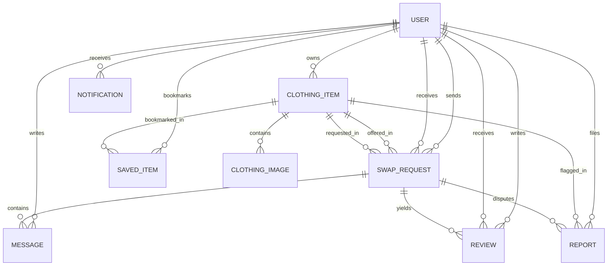

# Database Schema Documentation
## ReWear — Clothing Exchange & Swap Marketplace

---

## 1. Entity Relationship Diagram (ERD)

---

## 2. Model Specifications

### `User`
- `id`: String (UUID, Primary Key)
- `email`: String (Unique, Indexed)
- `password`: String (Bcrypt Hash)
- `name`: String
- `role`: String (`USER`, `ADMIN`, default `USER`)
- `avatarUrl`: String (Optional)
- `bio`: String (Optional)
- `city`: String (Default `Hyderabad`)
- `state`: String (Default `Telangana`)
- `rating`: Float (Default `5.0`)
- `swapCount`: Int (Default `0`)
- `isSuspended`: Boolean (Default `false`)
- `createdAt`, `updatedAt`: DateTime

### `ClothingItem`
- `id`: String (UUID, Primary Key)
- `title`: String
- `description`: String
- `category`: String (Indexed)
- `brand`: String (Indexed)
- `size`: String
- `color`: String
- `material`: String
- `condition`: String (`NEW_WITH_TAGS`, `LIKE_NEW`, `EXCELLENT`, `GOOD`, `FAIR`)
- `purchaseAge`: String
- `estimatedValue`: Float (Indexed)
- `originalPrice`: Float (Optional)
- `status`: String (`ACTIVE`, `PENDING_SWAP`, `SWAPPED`, `ARCHIVED`, `REMOVED`)
- `ownerId`: Foreign Key → `User.id` (Indexed)
- `city`, `state`: Geographic location tags

### `SwapRequest`
- `id`: String (UUID, Primary Key)
- `senderId`: Foreign Key → `User.id`
- `receiverId`: Foreign Key → `User.id`
- `offeredItemId`: Foreign Key → `ClothingItem.id`
- `requestedItemId`: Foreign Key → `ClothingItem.id`
- `status`: String (`PENDING`, `NEGOTIATING`, `ACCEPTED`, `SHIPPING`, `READY_FOR_EXCHANGE`, `COMPLETED`, `REJECTED`, `CANCELLED`, `DISPUTED`, `EXPIRED`)
- `exchangeMethod`: String (`LOCAL_MEETUP`, `SHIPPING`)
- `senderReady`: Boolean
- `receiverReady`: Boolean
- `completedAt`: DateTime (Optional)

### `Message`
- `id`: String (UUID, Primary Key)
- `swapId`: Foreign Key → `SwapRequest.id`
- `senderId`: Foreign Key → `User.id`
- `content`: String
- `messageType`: String (`TEXT`, `OFFER_MODIFIED`, `STATUS_CHANGE`)
- `read`: Boolean (Default `false`)

### `Review`
- `id`: String (UUID, Primary Key)
- `swapId`: Foreign Key → `SwapRequest.id`
- `reviewerId`: Foreign Key → `User.id`
- `revieweeId`: Foreign Key → `User.id`
- `rating`: Int (1–5)
- `comment`: String (Optional)
- Constraint: `@@unique([swapId, reviewerId])`
